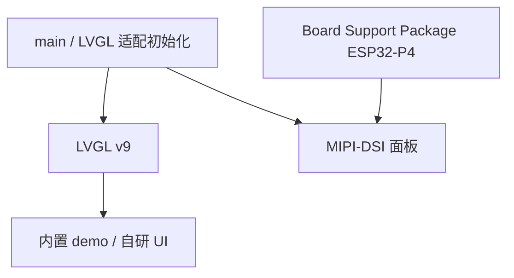
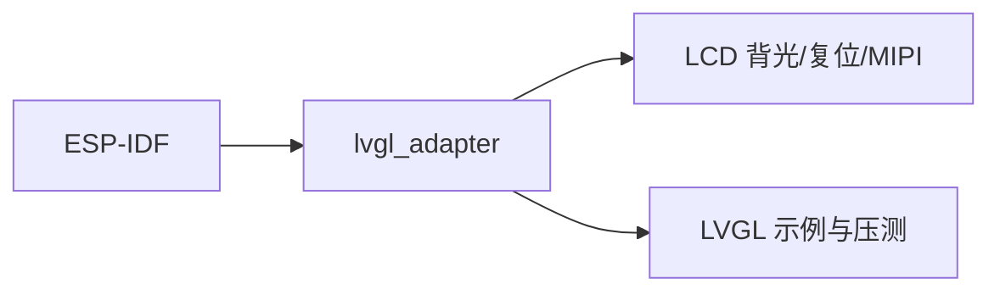

# Esp32p4_Lvgl_Demo

ESP32-P4 Function-EV-Board + MIPI-DSI（EK79007 7寸 1024x600）上的 **LVGL v9** 移植与性能测试示例。

## 系统架构图

```mermaid
flowchart TB
  MAIN[main / LVGL 适配初始化]
  MAIN --> LV[LVGL v9]
  MAIN --> DSI[MIPI-DSI 面板]
  LV --> UI[内置 demo / 自研 UI]
  BSP[Board Support Package ESP32-P4] --> DSI
```

## 功能框图

```mermaid
flowchart LR
  IDF[ESP-IDF] --> ADAPT[lvgl_adapter]
  ADAPT --> PANEL[LCD 背光/复位/MIPI]
  ADAPT --> DEMO[LVGL 示例与压测]
```

## 远程

origin → https://github.com/linxi27667/Esp32p4_Lvgl_Demo.git
